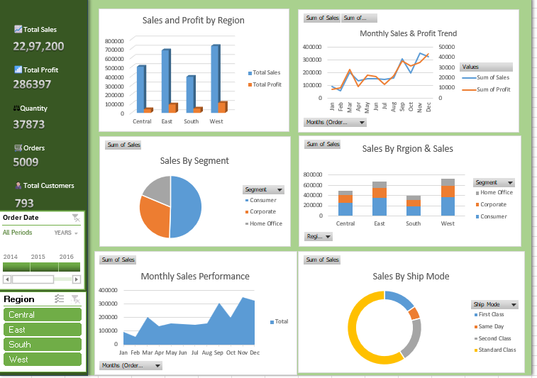

# Superstore Sales & Profit Analysis

An Excel-based Data Analytics project analyzing sales, profit, customers, orders, product categories, regions, and segments using the Superstore dataset.

### Dashboard Preview



## 📊 Project Overview

This project focuses on analyzing Superstore sales data using Microsoft Excel to identify sales trends, profitability patterns, regional performance, customer segments, and shipping preferences.

The project includes data cleaning, KPI calculations, PivotTable analysis, interactive dashboards, slicers, and business insights.

## 🛠️ Tools Used

- Microsoft Excel
- Power Query
- PivotTables
- PivotCharts
- Slicers
- Excel Formulas
- GitHub

## 📁 Dataset

The dataset contains approximately 9,994 sales records with 21 columns, including:

- Order ID
- Order Date
- Ship Date
- Ship Mode
- Customer ID
- Customer Name
- Segment
- Country
- City
- State
- Region
- Product ID
- Category
- Sub-Category
- Product Name
- Sales
- Quantity
- Discount
- Profit

## 🧹 Data Cleaning

Data preparation was performed using Power Query.

Steps included:

- Checking data types
- Converting date fields
- Removing duplicate rows
- Trimming and cleaning text fields
- Checking for errors and empty values
- Creating a cleaned dataset for analysis

## 📈 Key KPIs

| KPI | Value |
|---|---:|
| Total Sales | 2,297,200.86 |
| Total Profit | 286,397.02 |
| Total Quantity | 37,873 |
| Total Orders | 5,009 |
| Total Customers | 793 |
| Profit Margin | 12.47% |
| Average Order Value | 458.61 |

## 📊 Dashboard

The interactive Excel dashboard contains:

- Sales & Profit by Region
- Sales & Profit by Category
- Monthly Sales & Profit Trend
- Sales by Segment
- Sales by Region & Segment
- Monthly Sales Performance
- Sales by Ship Mode
- Year Timeline
- Region Slicer
- KPI Cards

## 🔍 Key Insights

- West region generated the highest sales and profit among the four regions.
- Technology generated the highest sales and profit among the three categories.
- Consumer segment generated the highest sales and profit among the three segments.
- 2017 recorded the highest annual sales and profit in the dataset.
- November recorded the highest monthly sales across the combined four-year period.
- December recorded the highest monthly profit across the combined four-year period.

## 📂 Project Structure

```text
superstore-sales-analysis/
│
├── README.md
│
├── data/
│   ├── raw/
│   └── processed/
│
├── excel/
│   └── Superstore_Sales_Analysis.xlsx
│
├── dashboard/
│   └── dashboard_preview.png
│
├── documentation/
│   ├── data_dictionary.md
│   └── project_insights.md
│
└── screenshots/
    ├── dashboard.png
    ├── sales_analysis.png
    └── profit_analysis.png

## 🎯 Business Questions

This project aims to answer the following business questions:

1. What are the overall sales and profit generated?
2. Which region generates the highest sales and profit?
3. Which product category contributes the most sales and profit?
4. Which customer segment generates the highest sales and profit?
5. How do sales and profit change from year to year?
6. Which months have the highest sales and profit?
7. How are sales distributed across different shipping modes?
8. What is the average order value?
9. How many unique customers and orders are present in the dataset?
10. How does regional performance vary across different customer segments?

## 🔄 Project Workflow

The project follows these steps:

1. Data Collection
2. Data Cleaning using Power Query
3. Data Transformation
4. Data Validation
5. KPI Calculation using Excel formulas
6. Exploratory Data Analysis using PivotTables
7. Data Visualization using PivotCharts
8. Dashboard Development
9. Business Insights Generation
10. Documentation and GitHub Presentation

## 🛠️ Tools & Technologies

- Microsoft Excel
- Power Query
- PivotTables
- PivotCharts
- Excel Formulas
- Slicers
- GitHub
- Markdown

## 📊 Dashboard

The interactive Excel dashboard provides a consolidated view of Superstore sales and profitability.

### Dashboard Features

- Total Sales
- Total Profit
- Total Quantity
- Total Orders
- Total Customers
- Sales & Profit by Region
- Sales & Profit Trend
- Sales by Segment
- Sales by Region & Segment
- Monthly Sales Performance
- Sales by Ship Mode
- Interactive Year and Region slicers

The dashboard allows users to explore sales performance across different regions, customer segments, categories, time periods, and shipping modes.


